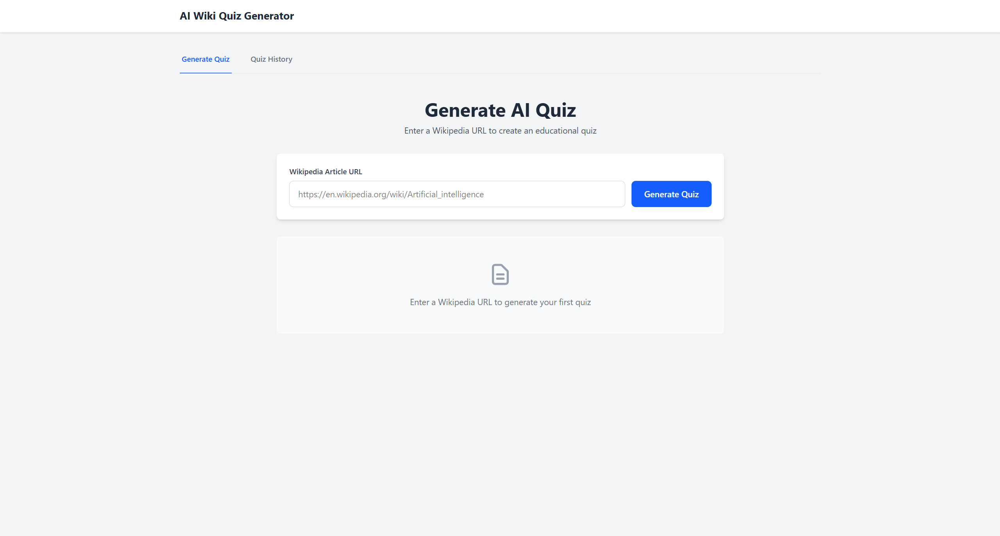

# 🧠 AI Wiki Quiz Generator

Transform any Wikipedia article into an interactive, educational quiz using AI! This full-stack application uses Google's Gemini AI to automatically generate engaging quizzes from Wikipedia content.


## ✨ Features

- 🔗 **URL Input**: Simply paste any Wikipedia article URL
- 🤖 **AI-Powered**: Uses Google Gemini to generate intelligent quiz questions
- 📝 **Smart Quizzes**: Creates 5-10 multiple choice questions with explanations
- 💾 **History Tracking**: Saves all generated quizzes in a database
- 🎯 **Interactive UI**: Take quizzes with instant feedback and scoring
- 📊 **Answer Explanations**: Learn why answers are correct or incorrect

## 🎥 Demo




## 🛠️ Tech Stack

### Backend
- **Python 3.10+** - Core programming language
- **FastAPI** - Modern web framework for APIs
- **SQLAlchemy** - Database ORM
- **LangChain** - Framework for LLM applications
- **Google Gemini** - AI model for quiz generation
- **BeautifulSoup4** - Web scraping library
- **SQLite** - Database for storing quizzes

### Frontend
- **React** - UI library
- **Tailwind CSS** - Styling framework
- **Vite** - Build tool

## 🚀 Quick Start

### Prerequisites

- Python 3.10 or higher
- Node.js 16+ and npm
- Google Gemini API key ([Get it here](https://makersuite.google.com/app/apikey))

### Installation

**1. Clone the repository**
```bash
git clone https://github.com/Srishanth57/QuizGeneratorAssignment.git
cd ai-wiki-quiz-generator
```

**2. Setup Backend**
```bash
cd backend

# Create virtual environment
python -m venv venv

# Activate it
# Windows:
venv\Scripts\activate
# Mac/Linux:
source venv/bin/activate

# Install dependencies
pip install -r requirements.txt

# Create .env file
echo "GEMINI_API_KEY=your_api_key_here" > .env
```

**3. Setup Frontend**
```bash
cd ../frontend

# Install dependencies
npm install
```

### Running the Application

**Start Backend (Terminal 1)**
```bash
cd backend
python main.py
```
Backend runs at `http://localhost:8000`

**Start Frontend (Terminal 2)**
```bash
cd frontend
npm run dev
```
Frontend runs at `http://localhost:5173`

**Open your browser and visit `http://localhost:5173`** 🎉

## 📖 How to Use

1. **Generate a Quiz**
   - Click on "Generate Quiz" tab
   - Paste a Wikipedia URL (e.g., `https://en.wikipedia.org/wiki/Artificial_intelligence`)
   - Click "Generate Quiz"
   - Wait 10-30 seconds for AI to create your quiz

2. **Take the Quiz**
   - Select answers for each question
   - Click "Submit Quiz" when done
   - See your score and read explanations

3. **View History**
   - Click "Quiz History" tab
   - See all your generated quizzes
   - Click "View Details" to retake any quiz

## 🏗️ Project Structure

```
ai-quiz-generator/
├── backend/
│   ├── database.py              # Database setup
│   ├── models.py                # Data models
│   ├── scraper.py               # Wikipedia scraper
│   ├── llm_quiz_generator.py    # AI quiz generation
│   ├── main.py                  # FastAPI app
│   ├── requirements.txt         # Python dependencies
│   └── .env                     # API keys (create this)
│
└── frontend/
    ├── src/
    │   ├── components/
    │   │   └── QuizDisplay.jsx  # Quiz UI component
    │   ├── services/
    │   │   └── api.js           # API calls
    │   ├── tabs/
    │   │   ├── GenerateQuizTab.jsx
    │   │   └── HistoryTab.jsx
    │   ├── App.jsx              # Main app
    │   └── index.css            # Styles
    └── package.json
```

## 🔌 API Endpoints

| Method | Endpoint | Description |
|--------|----------|-------------|
| POST | `/generate_quiz` | Generate quiz from Wikipedia URL |
| GET | `/history` | Get all generated quizzes |
| GET | `/quiz/{id}` | Get specific quiz by ID |

### Example Request
```bash
curl -X POST http://localhost:8000/generate_quiz \
  -H "Content-Type: application/json" \
  -d '{"url": "https://en.wikipedia.org/wiki/Python_(programming_language)"}'
```

## 🧪 Testing

**Test the Backend API**
```bash
# Visit the interactive API docs
http://localhost:8000/docs
```

**Test with Sample URLs**
- Python: `https://en.wikipedia.org/wiki/Python_(programming_language)`
- AI: `https://en.wikipedia.org/wiki/Artificial_intelligence`
- Space: `https://en.wikipedia.org/wiki/Solar_System`

## 🐛 Troubleshooting

### Backend Issues

**"GEMINI_API_KEY not found"**
- Make sure you created `.env` file in `backend` folder
- Check your API key is correct

**"Module not found"**
- Activate virtual environment: `source venv/bin/activate`
- Install dependencies: `pip install -r requirements.txt`

### Frontend Issues

**"Failed to fetch"**
- Make sure backend is running on port 8000
- Check if both frontend and backend are running

**Styles not loading**
- Run `npm install` again
- Clear browser cache

## 🤝 Contributing

Contributions are welcome! Please feel free to submit a Pull Request.

1. Fork the repository
2. Create your feature branch (`git checkout -b feature/AmazingFeature`)
3. Commit your changes (`git commit -m 'Add some AmazingFeature'`)
4. Push to the branch (`git push origin feature/AmazingFeature`)
5. Open a Pull Request

## 📝 License

This project is licensed under the MIT License - see the [LICENSE](LICENSE) file for details.

## 🙏 Acknowledgments

- [FastAPI](https://fastapi.tiangolo.com/) - Amazing Python web framework
- [LangChain](https://www.langchain.com/) - LLM application framework
- [Google Gemini](https://deepmind.google/technologies/gemini/) - Powerful AI model
- [Wikipedia](https://www.wikipedia.org/) - Source of knowledge

## 📧 Contact

Your Name - [@yourtwitter](https://twitter.com/yourtwitter)

Project Link: [https://github.com/yourusername/ai-wiki-quiz-generator](https://github.com/yourusername/ai-wiki-quiz-generator)

---

⭐ If you found this project helpful, please give it a star!

## 🔮 Future Enhancements

- [ ] User authentication and profiles
- [ ] Difficulty level selection
- [ ] Export quiz to PDF
- [ ] Share quizzes with friends
- [ ] Quiz analytics and statistics
- [ ] Support for multiple languages
- [ ] Mobile app version
- [ ] Timed quiz mode
- [ ] Leaderboard system

---

